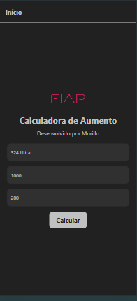

# Calculadora de Aumento

## Sobre o Projeto
Checkpoint 04 da matéria Mobile Application Development solicitado pelo professor Fernando Pinéo de Abreu


## 📷 Screenshots
| Tela Inicial | Tela de Cálculo |
|-------------|---------------|
|  |  |


## Tutorial de Como Rodar o Projeto
1. **Clone o repositório**
   ```sh
   git clone https://github.com/mulliru/Check-Point-04-Mobile-Application-Development.git
   cd seu-repositorio
   ```
2. **Instale as dependências**
   ```sh
   npm install
   ```
3. **Execute o Expo**
   ```sh
   npx expo start
   ```

## Desenvolvido por:
**Murillo Ferreira Ramos** - RM 553315

