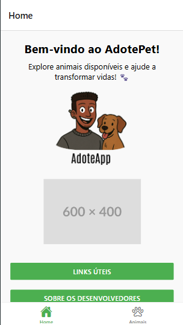
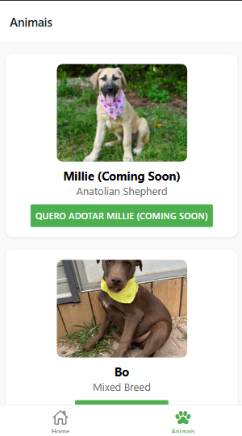
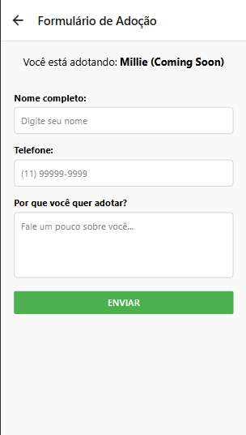
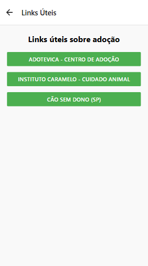

# AdotePet

## Sobre o Projeto
Checkpoint 05 da matéria **Mobile Application Development** solicitado pelo professor **Fernando Pinéo de Abreu**.

O aplicativo **AdotePet** tem como objetivo conectar pessoas interessadas em adotar animais a instituições e ONGs de proteção animal. Através da integração com a API do Petfinder, o usuário pode visualizar animais disponíveis para adoção e preencher um formulário de interesse.

---

## ✨ Funcionalidades

- Tela inicial com boas-vindas e navegação
- Listagem de animais com fotos e informações
- Integração com a API do Petfinder
- Formulário de adoção com validações e confirmação
- Links úteis para ONGs e instituições
- Tela com informações sobre os desenvolvedores
- Navegação por abas (Bottom Tabs) com ícones
- Design clean, responsivo e compatível com Web e Mobile

---

## 📷 Screenshots

<div align="center">





</div>

---

<div align="center">




</div>


---

## 🚀 Como Rodar o Projeto

1. **Clone o repositório**
   ```bash
   git clone https://github.com/mulliru/Check-Point-05-Mobile-Application-Development
   cd CheckPoint05
   ```

2. **Instale as dependências**
   ```bash
   npm install
   ```

3. **Execute o projeto com Expo**
   ```bash
   npx expo start
   ```

4. **Escaneie o QR Code com o app Expo Go no celular**  
   Ou clique em "Run in web browser" para testar via Web

---

## 🔧 Tecnologias Usadas

- React Native com Expo
- React Navigation
- React Native Vector Icons
- Petfinder API
- JavaScript
- Flexbox + estilos com StyleSheet

---

## 👨‍💻 Desenvolvido por:

**Murillo Ferreira Ramos**  
**RM 553315**
